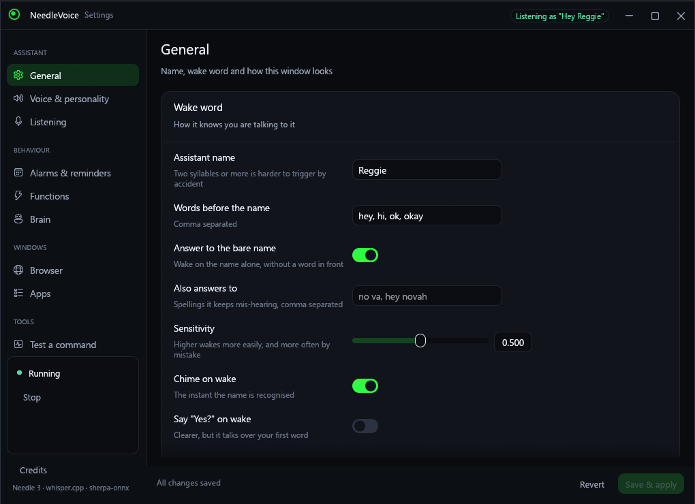
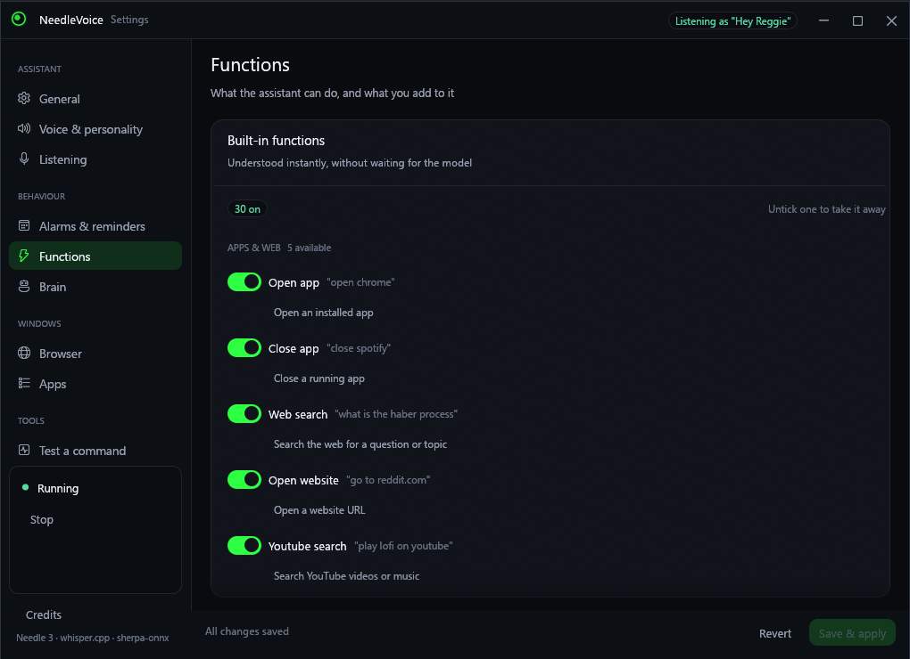
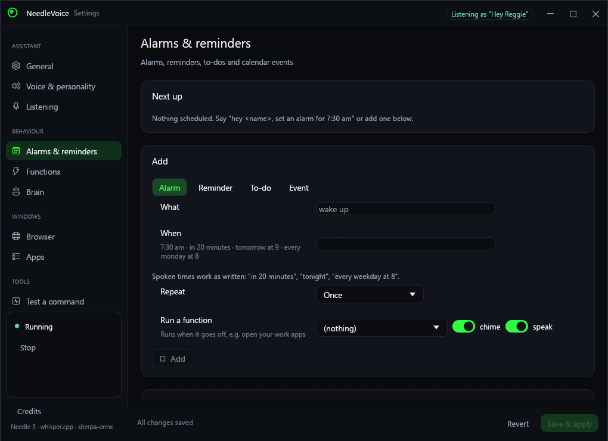
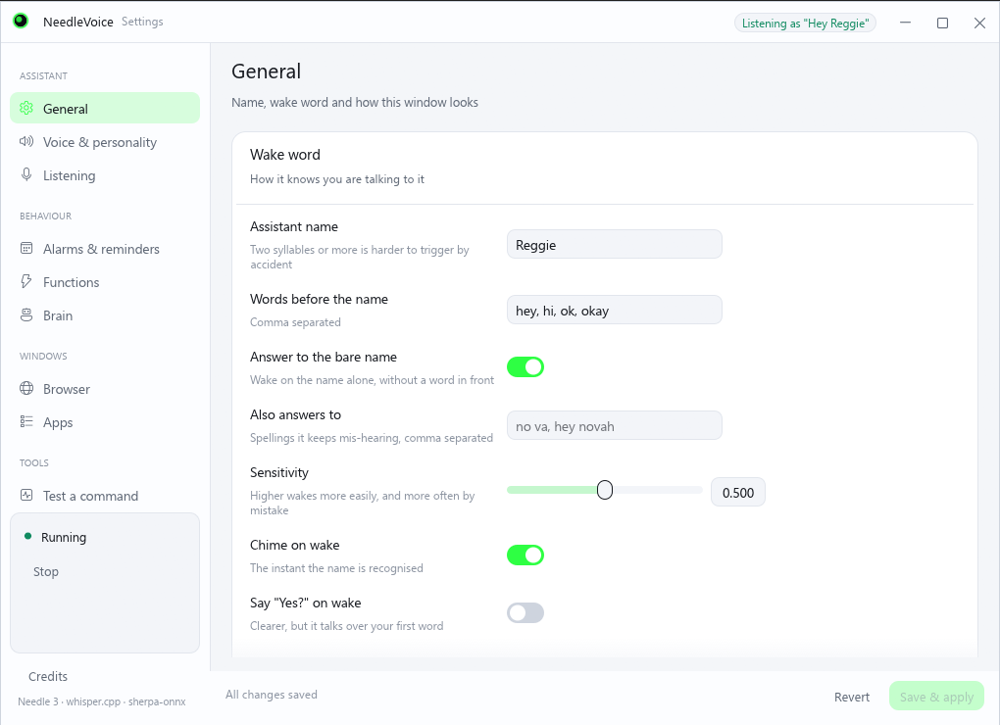

# NeedleVoice

An offline Windows voice assistant in Rust. Say **"Hey Nova, open Chrome"** or
**"Hey Nova, what is the Haber process?"**. A neon bubble pops up at the bottom
of the screen, [Needle 3](https://github.com/cactus-compute/needle) works out
what you want, and the assistant does it and answers out loud.

Everything runs locally: no cloud, no API keys.

## What it looks like

The settings window has its own title bar, grouped navigation and a page for
everything the assistant does. It follows Windows' light/dark setting, or you can
pin it either way:

| General | Functions |
| --- | --- |
|  |  |

| Alarms & reminders | Light appearance |
| --- | --- |
|  |  |

### Speech recognition: what each model costs

Measured on this machine (Ryzen 5 2600, 4 threads, a 3-second command) with
`NeedleVoice.exe --bench-stt <model> <clip.wav>`, which is the same code path the
assistant uses:

| Model | Size | Per command | Notes |
|---|---|---|---|
| `tiny.en-q5_1` | 31 MB | 0.44 s | Mishears words, and can loop on a repeat |
| `base.en-q5_1` | 57 MB | 0.65 s | Fine for clear speech |
| `small.en-q5_1` | 181 MB | 2.3 s | The best of the small ones |
| `medium.en-q5_0` | 514 MB | 6.0 s | **Default.** The most accurate that still runs on a CPU |
| `large-v3-turbo-q5_0` | 547 MB | 9.3 s | Larger, and *slower* than medium here: only its decoder is pruned, the encoder is full-size |

There is no small model that matches medium — that is the accuracy/size tradeoff,
not a tuning problem. What does change the picture is the graphics card:

```
cargo build --release -p nv-agent --features cuda     # needs the CUDA toolkit
cargo build --release -p nv-agent --features vulkan    # needs the Vulkan SDK
```

Either one runs medium several times faster than this CPU does, which is the only
way to have both accuracy and instant answers. Without it, the useful knobs are
`threads` (one per physical core — a Ryzen 5 2600 should use 6, not 4) and a
smaller model.

## What's inside

| Executable | What it does |
|---|---|
| `NeedleVoiceSetup.exe` | Installer (per-user, no admin). Also acts as `Uninstall.exe`. |
| `NeedleVoice.exe` | Background agent: tray icon, wake word, bubble, voice. |
| `NeedleVoiceConfig.exe` | Settings app. |

### Pipeline

```
mic ─► 16 kHz ─┬─► keyword spotter (3.3 M params, always on) ─► "hey <name>"?
               │                     │
               │      chime + bubble + listening, ~0.3 s after the name
               ▼
          WebRTC VAD ─► Whisper tiny (only on speech) ─► command
     ─► instant phrase match / Needle 3 tool call ─► any of the 30 built-in
        functions, or one you wrote yourself
     ─► personality line ─► Piper / Kokoro neural voice

scheduler ─► alarms · reminders · to-dos · calendar events
          ─► chime + bubble + spoken announcement, then run the function
             the item is wired to
```

* **Wake word**: a dedicated streaming keyword spotter (sherpa-onnx zipformer,
  3.3 M parameters, ~5 MB) listens continuously and fires the moment the name
  ends — no transcription, no waiting for the sentence to finish. It costs
  about 1.5 % of one core while silent. The name is turned into the model's
  sub-word tokens in Rust, so any name works, and extra spellings ("no va",
  "hey novah") can be added when an accent keeps being mis-heard. Without the
  model the agent falls back to Whisper plus fuzzy matching ("Hey Nova",
  "Hey, no va", "Heynova").
* **Functions**: every capability is one row in a catalogue that feeds three
  things at once — the tool list handed to Needle, the exact phrases that skip
  the model, and the settings app. Built-ins: open/close app, web search, open
  website, YouTube, media pause/resume/next/previous/stop, volume set/up/down,
  mute/unmute, time, date, lock, show desktop, screenshot, close window, and
  Windows Settings. Anything else is a **custom function**: a name, a
  description, parameters, an action (run a program, open a URL, press keys,
  run a PowerShell script, or just say something), trigger phrases and a reply.
  Templates for the common ones (shutdown, sleep, Spotify search, night light,
  empty recycle bin, …) are one click away.
* **Changing your mind**: after the wake word you can back out — "never mind",
  "forget it", "cancel that", "turn off", "stand down", "stop listening",
  "I changed my mind", "that's all". The assistant says one short word and goes
  back to waiting, instead of treating it as a command. The words it shares with
  real commands keep their meaning: "stop the music" still pauses, "cancel my
  alarm" still cancels the alarm.
* **Smarter functions**: besides the one-liners there are two ways to write
  something real. A **Python script** (dropped in the scripts folder) gets your
  parameters as arguments and as `NV_PARAM_*`, and whatever it prints last is
  spoken back — so "ask python what the weather is" can answer. A **sequence**
  chains steps without any code: say something, open a URL, press keys, run a
  program, PowerShell or Python, wait, call another function, or add something
  to the schedule — with `{output}` carrying what the previous step printed.
* **Alarms, reminders, to-dos and events**: "set an alarm for 7:30 am",
  "wake me up in 20 minutes", "remind me to take the pizza out at 6",
  "add buy milk to my list", "put the dentist on my calendar at 3 pm",
  "what's on my schedule", "read my list", "mark buy milk as done",
  "cancel my alarm". Times are spoken the natural way ("tomorrow at 9", "every
  weekday at 8", "every 30 minutes") and repeat daily, on weekdays, weekly or
  monthly. The list is `%APPDATA%\NeedleVoice\schedule.json`, it is announced
  even while the microphone is paused, and anything you missed while the
  machine was off is read out when the agent starts.
* **Brain**: Needle 3 (121M params, 35 MB) gets the command plus the enabled
  functions and returns JSON calls. Obvious commands ("open X", "what is X",
  "pause the music") skip the model and run instantly. Installed apps are not
  put in the prompt; Needle names the app and a fuzzy matcher resolves it
  against the scan.
* **App discovery**: the Start menu's `AppsFolder` (desktop and Store apps) plus
  shortcut folders. Rescanned at startup and every 30 minutes.
* **Searches** open as a new tab in the chosen browser (`chrome.exe <url>`).
* **Voice**: Piper (fast, natural, default) or Kokoro (most human-sounding,
  optional 334 MB download), both via sherpa-onnx. The classic Windows voices
  are a fallback.

### Resource use (measured on a Ryzen 5 2600)

* Idle: **~45 MB RAM, ~1.5 % of one core** — the wake-word spotter. Whisper,
  Needle and the voice are only loaded while needed and are freed after 60 s of
  quiet.
* Speech → text: ~0.2–0.4 s. Needle: instant for obvious commands, ~1.5–2.5 s
  otherwise (lower the depth in Settings to speed it up).
* Piper voice: ~0.3 s to synthesise a short reply.

## Building

Requires Rust (MSVC), CMake and LLVM (for whisper.cpp bindings).

```powershell
powershell -ExecutionPolicy Bypass -File scripts\build-installer.ps1
```

This downloads the bundled models into `models\`, builds everything and writes
`dist\NeedleVoiceSetup.exe`.

`.cargo\config.toml` matters: it forces `/O2` and AVX2 for whisper.cpp. Without
it, MSVC builds whisper.cpp unoptimised and it runs about 30× slower.

### Handy flags

* `NeedleVoice.exe --demo`: plays through every bubble state.
* `NeedleVoice.exe --say "text" [--config file.toml]`: speak once (used by voice preview).
* `NeedleVoice.exe --chime`: play the wake-up chime once (used by the settings app).
* `NeedleVoiceConfig.exe --tab voice|listening|schedule|brain|browser|apps|functions|test`
* `NeedleVoiceConfig.exe --config other.toml`: edit a different settings file
  (handy for trying a set of functions without touching the live ones).
* `NV_FAKE_MIC=<16 kHz mono wav>` plays a file into the agent in real time,
  which is how the wake word is tested without a microphone.
* `NeedleVoiceSetup.exe --silent [--dir X] [--no-launch] [--no-autostart]`
* `Uninstall.exe --silent --uninstall [--delete-settings]`

Settings are stored in `%APPDATA%\NeedleVoice\config.toml`, and the log is
`agent.log` in the same folder. The agent restarts itself when settings change.

## Layout

```
crates/nv-core    config, app discovery, function catalogue (built-ins +
                  custom, Python + step sequences), Needle brain, action runner,
                  schedule store + spoken-time parser, wake parsing, wake-model
                  downloader, personality lines, voice catalogue + downloader
crates/nv-agent   audio, VAD, Whisper, keyword spotter, listener state
                  machine, alarm scheduler, bubble overlay, tray, neural TTS
                  playback
crates/nv-config  settings UI (egui)
crates/nv-setup   installer/uninstaller with embedded zstd payload
```

## Licence

MIT — see [LICENSE](LICENSE). The models and libraries this project is built on
keep their own licences; [CREDITS.md](CREDITS.md) lists them, and doubles as the
NOTICE that Apache-2.0 components (Needle 3, sherpa-onnx) ask for.

## Credits

The interesting parts of this project belong to other people. The tool calling
is **Needle 3** by [Cactus Compute, Inc.](https://huggingface.co/Cactus-Compute/needle3)
(Apache-2.0), running on the
[needle-rs](https://github.com/geekgineer/needle-rs) engine; the speech is
**whisper.cpp** and **sherpa-onnx**, with the wake-word model, Piper voices and
**Kokoro** voices from the k2-fsa and rhasspy projects. See
[CREDITS.md](CREDITS.md) for the full list, the licences, and the citation the
Needle authors ask for:

```bibtex
@misc{needle3_2026,
  title        = {Needle: Foundation Tool-Calling Model for Tiny Devices},
  author       = {Ndubuaku, Henry and Mosoyan, Karen and Mroz, Jakub and Cylich, Noah and
                  Kumar, Satyajit and Sandhu, Parkirat and Shemet, Roman and Lee, Justin H.},
  year         = {2026},
  organization = {Cactus Compute, Inc.},
  howpublished = {\url{https://github.com/cactus-compute/needle}}
}
```

## Building from a clone

Models are not in the repository — they are a few hundred megabytes and each
one belongs to its publisher. Fetch them, then build:

```powershell
./scripts/fetch-models.ps1        # Needle + Whisper + the wake-word pack + a voice
cargo build --release
./scripts/build-installer.ps1     # optional: dist\NeedleVoiceSetup.exe
```

The tests that need a model skip themselves when it isn't there.
